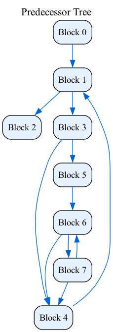
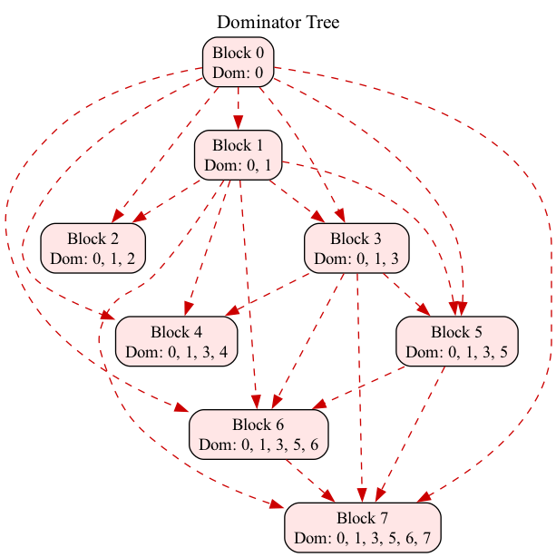
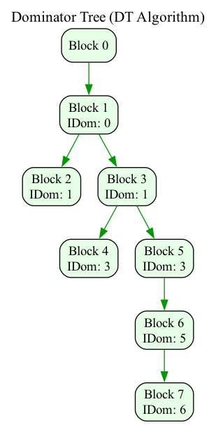
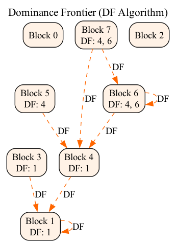
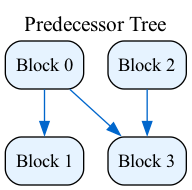
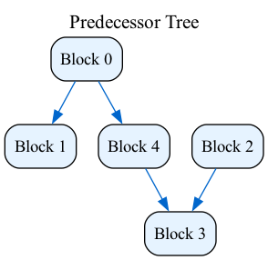

# Dominators

## Overview

This project implements a CFG analysis tool for computing dominators, dominance trees, and dominance frontiers. It uses several algorithms explained below for analyzing program control flow, mainly focused on the relationships between basic blocks in a graph.

## Features

- **Dominator Analysis**: Calculates dominators of each basic block.
- **Dominator Tree Construction**: Constructs the dominator tree from dominator data.
- **Dominance Frontier Calculation**: Computes the dominance frontier for each block.
- **Critical Edges Reduction**: Finds critical edges in graph and reduces them.
- **Graph Visualization**: Generates visual representations of each computed graph.

## Project Structure

```t
Dominators/
├── inc/
│   ├── BasicBlock.h        # BasicBlock representation
│   ├── Graph.h             # Main Graph class with different methods
│   ├── DAlgorithm.h        # Dominator Search algorithm
│   ├── DTAlgorithm.h       # Dominance Tree formation algorithm
│   ├── DFAlgorithm.h       # Dominance Frontier formation algorithm
│   ├── CEAlgorithm.h       # Critical Edges reduction algorithm
│   └── Dump.h              # Methods to plot all graphs
├── src/
│   └── main.cc             # Test for different graphs
├── src/                    
│   ├── *.png               # Directory where all dumped 
│   ...                     # graphs are saved by default
│   └── *.png
├── CMakeLists.txt          # Build configuration
└── README.md
```

## Building and Running

### Prerequisites

- C++20 compatible compiler (GCC 10+, Clang 12+)
- CMake 3.6+

### Build Instructions

```bash
mkdir build && cd build

cmake ..

make

./Dominator
```

All graphs dumps are saved in ```plots/``` by default

## Algorithms Used

### Dominator Search (DAlgorithm)

-> Computes dominator sets using a fixed-point iteration algorithm.

```c++
for (auto block : F.blocks()) Dom[block] = all; 
Changed = true;

while (Changed) {
    Changed = false;
    for (auto block : blocks) {
        Set Tmp = all;
        for (auto j: preds (block)) Tmp = intersect(Tmp, Dom[j]);
        append(Tmp, block);
        Changed = Changed | (Dom[i] != Tmp);
        if(Dom[i] != Tmp) Dom[i] = Tmp;
    }
}
```

### Dominance Tree (DTAlgorithm)

-> Constructs a tree where each block's parent is its immediate dominator.

```c++
DomTree = Graph{};

for(auto [I, Domset]: Dom){
    Domset = exclude(Domset, I);
    if(empty(Domset)) continue;
    if(size(Domset) == 1){
        auto H = head(Domset);
        add(DomTree, {H, I});
        continue
    }
    auto J = closest(Domset, I);
    add(DomTree, {J, I});
}
```

### Dominance Frontier (DFAlgorithm)

-> Computes the dominance frontier for each block, which is used to identify where definitions can reach in the presence of back edges.

```c++
auto analyseDF(Function F) {
    auto IDom = F.immediateDominatorSet();
    auto DF = Map<Block, Set<Block>>{};
    for (auto B : F.blocks)
        for (auto P: F. preds (B)) {
            auto R = P;
            while (R != IDom[B]) {
                DF [R] = DF[R] join B;
                R = IDom[R];
            }
        }
    return DF;
}
```

### Critical Edges (CEAlgorithm)

-> Finds critical edges in graph and reduces them, by adding additional basic blocks

My implementation is yet very simple and was not taken from any source

```c++
auto analyseCE() {
    for(auto predcessor: blocks_){
        if(predcessor.successors_number > 1){
            for(auto successor: predcessor.successors_){
                if(successor.predcessors_number > 1){
                    DeleteEdge(predcessor, successor);

                    AddBasicBlock(new_block); // add new block

                    AddEdge(predcessor, new_block);
                    AddEdge(new_block, successor);
                }
            }
        }
    }
}
```

## Examples

Control flow graph and ```DAlgorithm``` result to it:

<table>
  <tr valign="top">
    <td></td>
    <td></td>
  </tr>
</table>

Dominator tree and dominance frontier:

<table>
  <tr valign="top">
    <td></td>
    <td></td>
  </tr>
</table>

Graph before and after CEAlgorithm:

<table>
  <tr valign="top">
    <td></td>
    <td></td>
  </tr>
</table>
